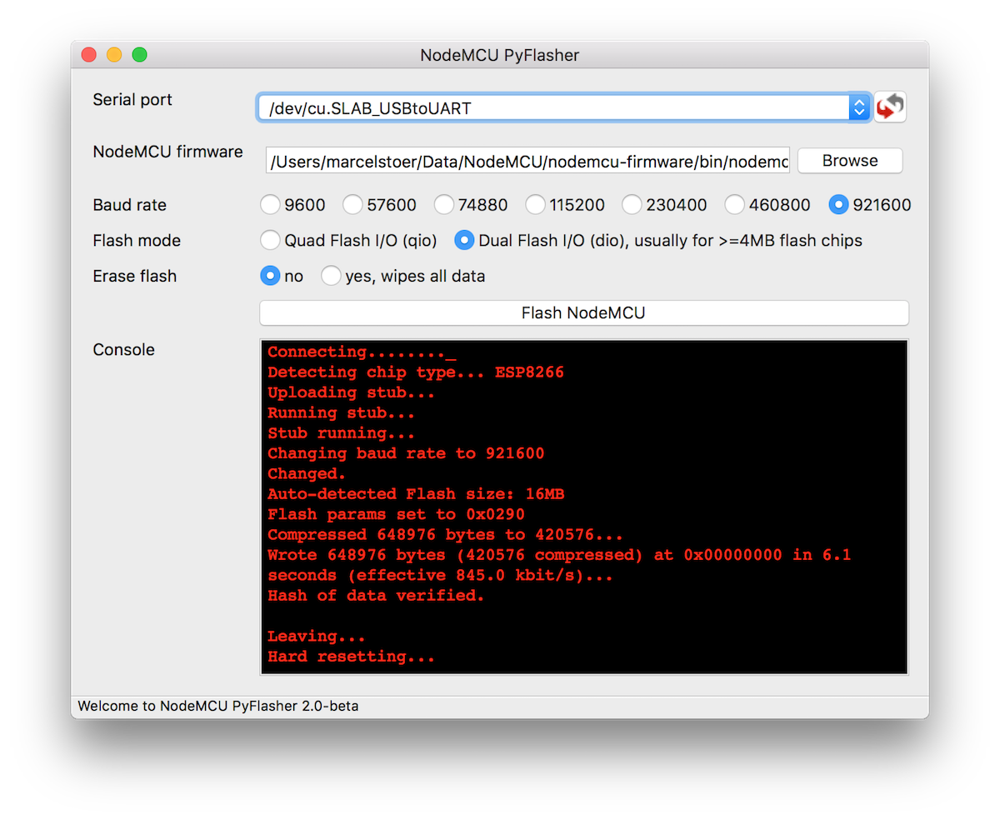

# NodeMCU PyFlasher

Self-contained [NodeMCU](https://github.com/nodemcu/nodemcu-firmware) flasher with GUI based on [esptool.py](https://github.com/espressif/esptool) and [wxPython](https://www.wxpython.org/).

## Status
Check the [releases section](https://github.com/marcelstoer/nodemcu-pyflasher/releases) for progress and downloadable binaries for your platform.
Scan the [list of open issues](https://github.com/marcelstoer/nodemcu-pyflasher/issues) for bugs and pending features.

- Due to [pyinstaller/pyinstaller#2355](https://github.com/pyinstaller/pyinstaller/issues/2355) I can't provide an app bundle for macOS yet. The PyInstaller `.spec` file and the build script are ready, though.
- Due to [esptool/issues/#155](https://github.com/espressif/esptool/issues/155) you'll see "debug" output from esptool.py when it attempts to reconnect to your device.

**Note** 

This is my first Python project. If you have constructive feedback as for how to improve the code please do reach out to me.

## Why this project exists

### Motivation
This addresses an issue the NodeMCU community touched on several times in the past, most recently at
 [#1500 (comment)](https://github.com/nodemcu/nodemcu-firmware/pull/1500#issuecomment-247884981).

I stated that based on my experience doing NodeMCU user support it should be a lot simpler to flash NodeMCU for Windows users.

- A number of flashing tools are available but only two are actively maintained: esptool-ck and esptool.py. Only one is endorsed by Espressif: [esptool.py](https://github.com/espressif/esptool) (they hired the developer(s)).
- 70% of the users of my [nodemcu-build.com](https://nodemcu-build.com) service are on Windows.
- BUT Windows doesn't come with Python installed - which is required for esptool.py.
- BUT Windows users in general are more reluctant to use the CLI than Linux/Mac users - which is required for esptool.py.

To conclude: this is not a comfortable situation for NodeMCU's largest user group.

### The plan
For quite a while I planned to write a self-contained GUI tool which would use esptool.py in the background. It should primarily target Windows users but since I'm on Mac it should be cross-platform. Even though I had never used Python before I felt confident to pull this off.

### Implementation
- Uses the cross-platform wxPython GUI framework. I also tried PyForms/PyQt4 but settled for wxPython.
- Requires absolutely minimal user input.
- The esptool.py "console" output is redirected to text control on the GUI.
- Uses [PyInstaller](https://github.com/pyinstaller/pyinstaller) to create self-contained executable for Windows and Mac. The packaged app can run standalone i.e. without installing itself, a Python interpreter or any modules.

## License
[MIT](http://opensource.org/licenses/MIT) © Marcel Stör
